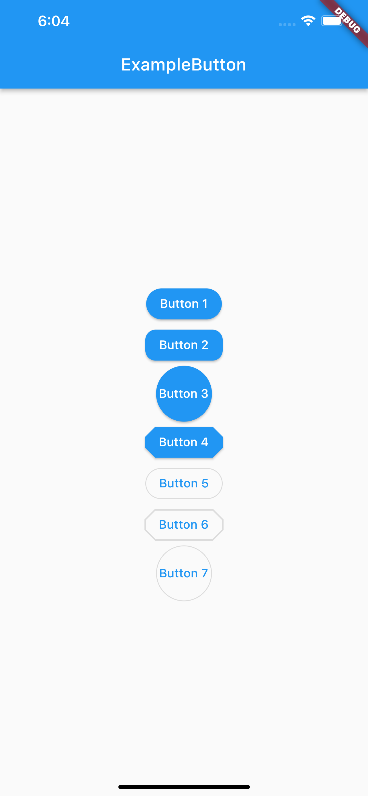

# flutter_style_button

<pre>

</pre>

```dart
class Button1 extends StatelessWidget {
  const Button1({
    Key? key,
  }) : super(key: key);

  @override
  Widget build(BuildContext context) {
    return ElevatedButton(
      onPressed: () {},
      style: ElevatedButton.styleFrom(
        shape: const StadiumBorder(),
      ),
      child: const Text('Button 1'),
    );
  }
}
```
```dart
class Button2 extends StatelessWidget {
  const Button2({
    Key? key,
  }) : super(key: key);

  @override
  Widget build(BuildContext context) {
    return ElevatedButton(
      onPressed: () {},
      style: ElevatedButton.styleFrom(
        shape: RoundedRectangleBorder(
          borderRadius: BorderRadius.circular(12), // <-- Radius
        ),
      ),
      child: const Text('Button 2'),
    );
  }
}
```
```dart
class Button3 extends StatelessWidget {
  const Button3({
    Key? key,
  }) : super(key: key);

  @override
  Widget build(BuildContext context) {
    return ElevatedButton(
      onPressed: () {},
      style: ElevatedButton.styleFrom(
        shape: const CircleBorder(),
        padding: const EdgeInsets.all(24),
      ),
      child: const Text('Button 3'),
    );
  }
}
```
```dart
class Button4 extends StatelessWidget {
  const Button4({
    Key? key,
  }) : super(key: key);

  @override
  Widget build(BuildContext context) {
    return ElevatedButton(
      onPressed: () {},
      style: ElevatedButton.styleFrom(
        shape: BeveledRectangleBorder(borderRadius: BorderRadius.circular(12)),
      ),
      child: const Text('Button 4'),
    );
  }
}
```
```dart
class Button5 extends StatelessWidget {
  const Button5({
    Key? key,
  }) : super(key: key);

  @override
  Widget build(BuildContext context) {
    return OutlinedButton(
      onPressed: () {},
      style: OutlinedButton.styleFrom(
        shape: const StadiumBorder(),
      ),
      child: const Text('Button 5'),
    );
  }
}
```
```dart
class Button6 extends StatelessWidget {
  const Button6({
    Key? key,
  }) : super(key: key);

  @override
  Widget build(BuildContext context) {
    return OutlinedButton(
      onPressed: () {},
      style: OutlinedButton.styleFrom(
        shape: BeveledRectangleBorder(
          borderRadius: BorderRadius.circular(12),
        ),
      ),
      child: const Text('Button 6'),
    );
  }
}
```
```dart
class Button7 extends StatelessWidget {
  const Button7({
    Key? key,
  }) : super(key: key);

  @override
  Widget build(BuildContext context) {
    return OutlinedButton(
      onPressed: () {},
      style: OutlinedButton.styleFrom(
        shape: const CircleBorder(),
        padding: const EdgeInsets.all(24),
      ),
      child: const Text('Button 7'),
    );
  }
}
```

---

```
Copyright 2022 M. Fadli Zein
```